# KLETECH HACKFEST 2026 — SCREENING ROUND IDEA PRESENTATION
## Project Rakshak 2.0 (रक्षक): Sovereign Multimodal Geospatial Threat Intelligence & Joint C4ISR System

> **Official PPTX Presentation File Generated**: [`Project_Rakshak_KLETECH_Hackfest_2026.pptx`](file:///c:/Users/awhri/OneDrive/Desktop/DEF/Project_Rakshak_KLETECH_Hackfest_2026.pptx)  
> **Target Event**: KLETECH Hackfest 2026 — Screening Round Idea Presentation  
> **Submission Deadline**: 5 October 2026, 5:00 p.m.  
> **Team Name**: **BotS**  
> **Team Members**: Aditya Bajantri, Gagan Bongale, Utsav Nanapur, Misbah Falak, Shalina Maniyar, Niyati Gogri  
> **Institution**: KLE Technological University, Hubballi  
> **Selected Domain**: Domain 1A — Sovereign Defense, Geospatial Intelligence & Joint C4ISR  
> **Slide Constraint**: Strictly 6 Slides (Compliant with official screening rules)

---

## Slide-by-Slide Content & Visual Structure

### Slide 1: Project Overview & Problem Statement
* **Category Tag**: `KLETECH HACKFEST 2026 // SCREENING ROUND IDEA PRESENTATION | SLIDE 1 OF 6`
* **Title**: **Project Overview & Problem Statement**
* **Subtitle**: *Project Title, Team Details, Selected Domain, Target Users & The Problem Statement*

```
┌──────────────────────────────────────────────────────────┬──────────────────────────────────────────────────────────┐
│         PROJECT RAKSHAK 2.0 (रक्षक) — IDENTITY            │      THE OPERATIONAL PROBLEM (INFORMATION SATURATION)    │
├──────────────────────────────────────────────────────────┼──────────────────────────────────────────────────────────┤
│ • Official Title: Project Rakshak 2.0: Sovereign         │ 1. Gigapixel Rasters vs Tiny Targets: Satellite/UAV     │
│   Multimodal Geospatial Threat Intelligence & Joint      │    rasters exceed 20,000×20,000 px (>500MB). Tactical   │
│   C4ISR System                                           │    targets (tanks, vessels) occupy only 15×15 px.       │
│ • Team Name: Team BotS                                   │    Standard AI downsamples to 640×640, completely       │
│ • Team Members: Aditya Bajantri, Gagan Bongale,          │    erasing small targets.                               │
│   Utsav Nanapur, Misbah Falak, Shalina Maniyar,          │ 2. Maritime "Dark Vessels" & AIS Spoofing: Adversary    │
│   Niyati Gogri (KLE Tech University, Hubballi)           │    intelligence ships and illegal trawlers disable AIS  │
│ • Selected Domain: Domain 1A — Sovereign Defense,        │    transponders or spoof MMSI identities in critical    │
│   Geospatial Intelligence & Joint C4ISR                  │    chokepoints (Malacca Strait, Mumbai ODA buffer).  │
│ • Operational Posture: 100% Air-Gapped, Zero External    │ 3. Multi-Domain Sensor Silos: Naval radar, satellite   │
│   Cloud/API Callouts, Field-Edge Deployable (EMCON Alpha)│    passes, Army drone video downlinks (FMV), and ground │
│ • Target Users: Maritime Ops Centers (Indian Navy /      │    sensors operate in isolated stovepipes.              │
│   Coast Guard), Forward Operating Bases (Indian Army),   │ 4. Cloud Vulnerability at Forward Edges: Commercial     │
│   Tactical Recon & UAV Ground Station Operators.         │    cloud AI (AWS, Azure, OpenAI) is unusable under      │
│ • Core Mission: Deliver automated, sub-second threat     │    EMCON radio silence, jamming, and sovereignty laws.  │
│   detection, dark vessel interdiction, and Rules of      │                                                          │
│   Engagement (RoE) advisory in bandwidth-denied edges.   │                                                          │
└──────────────────────────────────────────────────────────┴──────────────────────────────────────────────────────────┘
```

---

### Slide 2: Proposed Solution & Objectives
* **Category Tag**: `KLETECH HACKFEST 2026 // SCREENING ROUND IDEA PRESENTATION | SLIDE 2 OF 6`
* **Title**: **Proposed Solution & Key Objectives**
* **Subtitle**: *Core Concept, Tactical Objectives, Core Architectural Features & Strategic Operational Benefits*

```
┌───────────────────────────────┬───────────────────────────────┬───────────────────────────────┐
│     CORE SOLUTION CONCEPT     │     KEY TACTICAL OBJECTIVES   │   INTENDED BENEFITS & IMPACT  │
├───────────────────────────────┼───────────────────────────────┼───────────────────────────────┤
│ • Sovereign Joint COP: Single │ • Objective 1: Sub-Pixel      │ • Sensor-to-Shooter           │
│   unified tactical HUD fusing │   Accuracy: Detect targets    │   Acceleration: Shrinks threat│
│   satellite EO, SAR radar,    │   <20px without downsampling  │   verification time from 45+  │
│   UAV video, and AIS data.    │   loss (>43% mAP50, >44%      │   mins of manual scanning     │
│ • On-Premise Neural Engine:   │   recall).                    │   down to under 3 seconds.    │
│   Dual-engine computer vision │ • Objective 2: Dark Vessel    │ • Zero False-Alarm Clutter:   │
│   (YOLO11m 20.1M params +     │   Intercept: All-weather SAR  │   Physical geometry filters   │
│   1024px Vessel Specialist)   │   CFAR radar cross-referenced │   (aspect ratio <= 4.5)       │
│   with Weighted Box Fusion.   │   against local AIS registry. │   eliminate 85% of false      │
│ • Real-World Georeferencing:  │ • Objective 3: O(N) Threat    │   alarms (shadows, curbs).    │
│   Direct affine transformation│   Geofencing: Sub-second grid │ • 100% Data Sovereignty: All  │
│   (Rasterio/GDAL) mapping     │   hashing to flag convoys     │   data and intelligence remain│
│   pixels to WGS-84 Lat/Lon.   │   (+20) and zone breaches     │   on local hardware; zero     │
│ • Air-Gapped Sovereign RAG:   │   (+30) in <80ms.             │   foreign cloud leakage.      │
│   Cryptographic doctrine and  │ • Objective 4: Frontline      │ • Interoperable Joint Action: │
│   RoE advisory synthesized in │   Portability: Runs on laptops│   1-click dispatch transfers  │
│   <40ms with zero cloud calls.│   and 15W NVIDIA Jetson units.│   RoE tasks to Mission Planner│
└───────────────────────────────┴───────────────────────────────┴───────────────────────────────┘
```

---

### Slide 3: Innovation & Existing Alternatives
* **Category Tag**: `KLETECH HACKFEST 2026 // SCREENING ROUND IDEA PRESENTATION | SLIDE 3 OF 6`
* **Title**: **Innovation & Existing Alternatives**
* **Subtitle**: *Comparative Analysis: Conventional Defense Approaches vs Baseline Vision vs Project Rakshak 2.0*

| Capability Dimension | Conventional Military C2 (Legacy) | Standard Vision Models (YOLO Baseline) | Project Rakshak 2.0 (Our Innovation) |
| :--- | :--- | :--- | :--- |
| **Gigapixel Image Processing** | Manual human photo-interpreter review; multi-hour latency. | Resizes whole image to 640×640, completely erasing targets <20px. | **1024×1024 overlapping slicing + Weighted Box Fusion (WBF)**. Zero target clipping. |
| **Dark Vessel Interdiction** | Relies entirely on cooperative AIS transponders; easily spoofed. | Optical-only detection; completely blinded by night, clouds, and haze. | **Sentinel-1 SAR Radar CFAR backscatter cross-correlated against AIS logs**. Flags non-broadcasting contacts. |
| **Spatial Threat Scoring** | Manual threat plotting on tactical charts; prone to operator lag. | Returns unconstrained raw bounding boxes without tactical context. | **Sub-second $O(N)$ spatial grid hashing**. Autonomous convoy (+20) and geofence (+30) scoring in 80ms. |
| **Network & Infrastructure** | Heavy centralized cloud server dependencies; vulnerable to jamming. | Requires external REST APIs and continuous cloud connectivity. | **100% Air-Gapped Sovereign Edge runtime**. Operates under strict EMCON radio silence. |
| **Tactical Doctrine & RoE** | Physical printed doctrine binders or cloud LLMs (security leak). | No doctrine or operational decision support capability. | **Sovereign Air-Gapped RAG Advisor**: 8 indexed military doctrines with verified citations in <40ms. |

> **Key Innovation Summary**: Project Rakshak combines sub-pixel neural vision, SAR-AIS cross-cueing, $O(N)$ spatial threat math, and sovereign RAG into an integrated, zero-cloud edge package that operates seamlessly in frontline combat conditions.

---

### Slide 4: System Architecture & Workflow
* **Category Tag**: `KLETECH HACKFEST 2026 // SCREENING ROUND IDEA PRESENTATION | SLIDE 4 OF 6`
* **Title**: **System Architecture & Operational Workflow**
* **Subtitle**: *Labelled Multi-Tier Architecture Diagram, Real-Time Data Flow & Frontline Operator Workflow*

```mermaid
flowchart LR
    subgraph T1["TIER 1: SENSOR INGESTION"]
        A1["Satellite EO GeoTIFF\n(Sentinel / xView)"]
        A2["SAR Radar Streams\n(Sentinel-1 / RISAT)"]
        A3["Tactical Drone FMV\n(RTSP / MP4 Video)"]
        A4["AIS Transponder\n& SIGINT Intercepts"]
    end

    subgraph T2["TIER 2: NEURAL VISION"]
        B1["1024x1024 Sub-Pixel Slicer\n(31% Overlap Stride)"]
        B2["Dual-Engine Ensemble\n(YOLO11m + Vessel Spec)"]
        B3["Weighted Box Fusion\n(WBF IoU 0.35)"]
        B4["Physical Sanity Gating\n(Aspect Ratio <= 4.5)"]
    end

    subgraph T3["TIER 3: SPATIAL THREAT"]
        C1["WGS-84 Georeferencer\n(Pixel to Lat/Lon Affine)"]
        C2["SAR-AIS Correlator\n(1.2 km Kinematic Radius)"]
        C3["O(N) Spatial Grid Hash\n(Clustering & Convoys)"]
        C4["Geofence Rules Engine\n(Mumbai ODA, Sector Alpha)"]
    end

    subgraph T4["TIER 4: TACTICAL C2 & RAG"]
        D1["Sovereign RAG Advisor\n(Air-Gapped RoE Engine)"]
        D2["Executive BLUF Briefing\n(<40ms Local Synthesis)"]
        D3["React 19 Leaflet COP\n(Military Dark HUD)"]
        D4["Mission Planner Dispatch\n(1-Click Action Order)"]
    end

    T1 --> T2 --> T3 --> T4
```



* **Frontline Operator Workflow (Step-by-Step)**:
  `Step 1: Ingestion` -> Operator loads satellite pass or drone feed  
  `Step 2: Automated Detection` -> System executes sub-pixel detection & SAR-AIS correlation  
  `Step 3: Threat Evaluation` -> $O(N)$ threat engine flags high-risk contacts & geofence breaches  
  `Step 4: Decision & Dispatch` -> Sovereign RAG generates authorized RoE directive & dispatches action checklist to Mission Planner in <3 seconds.

---

### Slide 5: Technology Stack & Implementation Plan
* **Category Tag**: `KLETECH HACKFEST 2026 // SCREENING ROUND IDEA PRESENTATION | SLIDE 5 OF 6`
* **Title**: **Technology Stack & Implementation Plan**
* **Subtitle**: *Strategic Technology Choices ('The Why'), Team Responsibilities & Hackathon Development Roadmap*

```
┌──────────────────────────────────────────────────────────┬──────────────────────────────────────────────────────────┐
│        CHOSEN TECHNOLOGIES & STRATEGIC JUSTIFICATIONS    │        TEAM BotS RESPONSIBILITIES & WORK ALLOCATION      │
├──────────────────────────────────────────────────────────┼──────────────────────────────────────────────────────────┤
│ • AI / Vision: YOLO11m (Medium 20.1M params) + PyTorch   │ • AI & Neural Vision Leads: Aditya Bajantri & Gagan      │
│   delivers +78.9% recall boost over nano models, running │   Bongale: YOLO11m training, multi-tile sliding window   │
│   at 45+ FPS with FP16 Tensor Cores on edge GPUs.        │   slicer, WBF tuning, and physical geometry filters.     │
│ • Geospatial: Rasterio + GDAL + OpenCV reads GeoTIFF     │ • Geospatial & Backend Leads: Utsav Nanapur & Misbah     │
│   affine matrices to project pixels directly to WGS-84.  │   Falak: FastAPI architecture, Rasterio coordinate       │
│ • Threat Engine: O(N) Spatial Hash Grid (Python 3.11)    │   mapping, SAR CFAR radar detector, & SQLite WAL database│
│   replaces slow O(N^2) pairwise loops, computing 2,500+  │ • Tactical UI & Systems Leads: Shalina Maniyar & Niyati  │
│   contacts in 80ms (400x speedup).                       │   Gogri: React 19 Leaflet geospatial dashboard, dark     │
│ • Local Database: SQLite 3 in WAL Mode delivers zero     │   HUD components, Sovereign RAG integration, & testing.  │
│   daemon overhead, zero crashes, and sub-ms atomic reads.├──────────────────────────────────────────────────────────┤
│ • Backend API: FastAPI + Uvicorn provides high-throughput│       HACKATHON IMPLEMENTATION ROADMAP (HOURS 0-36)      │
│   async streaming for gigabyte GeoTIFFs and OpenAPI docs.├──────────────────────────────────────────────────────────┤
│ • Tactical UI: React 19 + TypeScript + Vite + Leaflet    │ • Phase 1 (0-8h): Ingestion pipeline & baseline models.  │
│   delivers zero-lag dark HUD and offline tile caching.   │ • Phase 2 (8-20h): Dual-engine vision & SAR-AIS fusion.  │
│                                                          │ • Phase 3 (20-28h): React 19 Leaflet HUD & Sovereign RAG.│
│                                                          │ • Phase 4 (28-36h): Edge stress-testing & demo rehearsal.│
└──────────────────────────────────────────────────────────┴──────────────────────────────────────────────────────────┘
```

---

### Slide 6: Expected Outcomes & Demo Plan
* **Category Tag**: `KLETECH HACKFEST 2026 // SCREENING ROUND IDEA PRESENTATION | SLIDE 6 OF 6`
* **Title**: **Expected Outcomes, Demo Plan & Success Metrics**
* **Subtitle**: *Planned Deliverables, Interactive Live Demo Flow, Measures of Success & Risk Mitigation*

```
┌───────────────────────────────┬───────────────────────────────┬───────────────────────────────┐
│       PLANNED DELIVERABLES    │   INTERACTIVE LIVE DEMO PLAN  │ SUCCESS METRICS & MITIGATIONS │
├───────────────────────────────┼───────────────────────────────┼───────────────────────────────┤
│ 1. Joint Tactical C2 Dashboard│ • Act 1: Massive Satellite    │ • Key Measures of Success:    │
│    Fully functional browser   │   Ingestion: Upload 3000x3000 │   - Accuracy: 43.3% mAP@50 and│
│    COP with optical, SAR,     │   satellite scene -> detects  │     44.0% Recall (+78.9% boost│
│    and drone reconnaissance.  │   dispersed convoys in 1.4s.  │   - Latency: <1.8s for multi- │
│ 2. Sub-Pixel Vision Pipeline: │ • Act 2: SAR Dark Vessel      │     tile satellite inference. │
│    Real-time sliding window   │   Isolation: Switch to SAR -> │   - Threat Math: <80ms for    │
│    analysis detecting small   │   detects dark vessel in      │     2,500+ contacts.          │
│    targets in <1.8s.          │   Mumbai ODA buffer ->        │   - Air-Gap: Zero cloud calls.│
│ 3. SAR Dark Vessel Interceptor│   triggers Threat Score 88.   │ • Datasets & Dependencies:    │
│    Automated radar backscatter│ • Act 3: Sovereign RAG & RoE: │   - Pre-cached xView & SAR.   │
│    cross-referenced with AIS. │   Query Mumbai ODA RoE ->     │   - ZERO paid external APIs;  │
│ 4. Sovereign Air-Gapped RAG:  │   instant human-readable      │     100% offline executable.  │
│    Instant doctrine advisor   │   BLUF summary in 36ms.       │ • Key Risks & Mitigations:    │
│    synthesizing RoE in <40ms. │ • Act 4: 1-Click Dispatch:    │   - GPU OOM: Mitigated via    │
│ • MVP vs Future Scope:        │   Click 'Dispatch Directive'  │     1024px streaming crops.   │
│   - MVP: Full software C2.    │   -> creates operational tasks│   - Network Denied: All models│
│   - Future: NavIC GPS & drone │   with assigned units.        │     and tiles pre-cached.     │
└───────────────────────────────┴───────────────────────────────┴───────────────────────────────┘
```

---

## 3. Verbal Pitch Script for Whritik & Team (Word-for-Word Guide)

### Slide 1 Speech (0:00 - 0:45)
> "Respected judges, we are Team Rakshak representing KLE Technological University under Domain 1A: Sovereign Defense, Geospatial Intelligence, and Joint C4ISR. Frontline military commanders face a paradoxical crisis: information saturation with actionable starvation. A single satellite pass contains 400 million pixels, but a combat vehicle or missile transporter occupies barely 15 pixels. Conventional deep learning resizes images, obliterating these tiny targets. Meanwhile, adversary warships turn off their AIS transponders to become 'dark vessels', and cloud-based AI tools are completely unusable under military EMCON radio silence and jamming. Project Rakshak 2.0 solves this by bringing automated, sub-pixel threat intelligence directly to the frontline edge in a 100% sovereign, air-gapped system."

### Slide 2 Speech (0:45 - 1:30)
> "Our solution is a self-contained Joint Common Operating Picture that fuses optical satellite passes, synthetic aperture radar (SAR), drone video, and AIS transponder registries onto a single tactical HUD. We have four core objectives: First, sub-pixel detection using our sliding-window tiling engine to catch targets under 20 pixels with 44% recall. Second, all-weather dark vessel interdiction by evaluating SAR radar cross-sections against local AIS databases. Third, sub-second spatial threat geofencing to detect convoy formations and zone breaches in 80 milliseconds. And fourth, our Sovereign Air-Gapped RAG engine that provides instantaneous, citation-backed Rules of Engagement guidance to commanders without sending a single byte to external clouds."

### Slide 3 Speech (1:30 - 2:15)
> "Looking at the competitive landscape, legacy military C2 systems rely on slow manual photo-interpreters and cooperative AIS transponders that adversaries easily spoof. Standard open-source vision models downsample rasters or crash on images larger than 4K. Project Rakshak innovates in five distinct ways: we use 1024-pixel overlapping crops with Weighted Box Fusion to preserve raw ground resolution; we combine SAR radar backscatter with AIS to unmask dark vessels day or night; we use an O(N) spatial grid hash that computes threat scores 400 times faster than pairwise algorithms; and we embed a localized RAG engine that provides verifiable legal doctrine and 1-click mission planning."

### Slide 4 Speech (2:15 - 3:00)
> "Our architecture is structured into four real-time tiers: Tier 1 ingests multimodal sensor inputs including GeoTIFFs, Sentinel-1 radar, and drone downlinks. Tier 2 handles neural vision using our dual-engine ensemble—combining our custom-trained YOLO11m medium model with our dedicated vessel specialist, filtered by physical geometry constraints to reject false alarms. Tier 3 performs real-world WGS-84 coordinate mapping and O(N) threat scoring. Tier 4 powers the tactical C2 console and our Sovereign RAG engine. For the operator, the workflow is seamless: ingest data, let the system detect and isolate dark threats, inspect the threat score, and dispatch a doctrine-backed mission order in under 3 seconds."

### Slide 5 Speech (3:00 - 3:45)
> "Every technology in our stack was chosen for frontline resilience. We chose YOLO11m because its 20 million parameters provide a 78.9% recall boost over nano models while maintaining 45+ frames per second on local GPUs. We chose Rasterio and GDAL to maintain coordinate integrity from pixel space to real-world latitude and longitude. We chose SQLite in WAL mode because defense edge nodes cannot afford database daemon crashes or port conflicts. And our frontend runs on React 19 and Leaflet with local offline tile caching. Our team is structured across AI & Neural Vision, Geospatial & Backend, and Tactical UI Systems, operating on a focused 36-hour hackathon implementation plan."

### Slide 6 Speech (3:45 - 4:30)
> "During the hackathon, our live demonstration will showcase four concrete operational acts: First, we will upload a massive 3000x3000 satellite scene and demonstrate sub-pixel detection of military convoys in 1.4 seconds. Second, we will switch to our SAR radar overlay and isolate an unflagged dark vessel breaching the Mumbai ODA buffer zone, triggering an automated Threat Score of 88. Third, we will query our Sovereign RAG engine and show how it synthesizes an executive military briefing under UNCLOS and Indian Navy RoE in 36 milliseconds. And fourth, we will click 'Dispatch to Mission Planner' to convert the directive into actionable military tasks. Project Rakshak 2.0 requires zero paid APIs, zero cloud connectivity, and is ready to defend our sovereign borders. Thank you, and we welcome your questions."

---

## 4. Judging Defense Q&A Prep

| Anticipated Judge Question | Recommended Authoritative Response |
| :--- | :--- |
| **"Why not use cloud LLMs like GPT-4 or Claude for your tactical advisor?"** | *"In frontline combat environments, warships operate under strict EMCON (Emission Control) radio silence, and forward operating bases face active electronic warfare and satellite link jamming. Sending tactical military coordinates or querying Rules of Engagement over public internet violates Indian Defense Information Security Guidelines (DISG). Our localized RAG engine runs 100% on-premise, delivers verified citations from Indian defense doctrines, and responds in under 40 milliseconds with zero cloud exposure."* |
| **"Why train YOLO11m instead of using zero-shot foundation models like Segment Anything (SAM) or Grounding DINO?"** | *"Foundation models like SAM require 24GB+ VRAM enterprise servers and introduce multi-second latencies per image, making them unfeasible on frontline laptops or tactical drone gimbals. YOLO11m has 20.1M parameters, runs with FP16 Tensor Core acceleration at 45+ FPS, and consumes only ~4GB VRAM. We achieved a 44% recall rate and 43.3% mAP@50 while retaining sub-second inference."* |
| **"How do you handle false positives on high-altitude aerial imagery?"** | *"Aerial false positives typically stem from low confidence thresholds and non-target terrain textures (curbs, shadows, painted road markings). We solved this with a three-layer defense: First, physical sanity bounding-box gating (aspect ratio <= 4.5:1, vehicle dimensions 10–110px). Second, an operational confidence floor of 45%. And third, Weighted Box Fusion with an IoU of 0.35 that consolidates multi-tile boundary duplicates."* |
| **"Is this prototype realistically buildable during the hackathon?"** | *"Yes, 100%. Our core neural detection models, SAR backscatter algorithms, spatial hashing, and SQLite schema are already trained, tested, and operational on local hardware. During the hackathon, we will focus on live multimodal fusion, edge latency optimization, and refining the tactical mission dispatch workflow."* |
